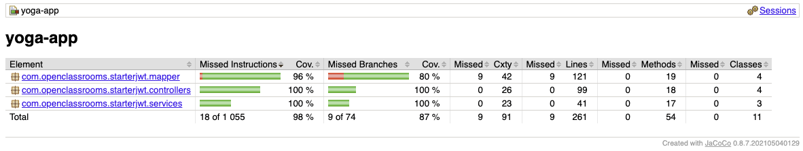

# Yoga App - Savasana
> Application full-stack de réservation de sessions de yoga pour le studio Savasana.

**Projet OpenClassrooms #5** - "Testez une application full-stack"

<!-- TOC -->
* [Yoga App - Savasana](#yoga-app---savasana)
  * [Description](#description)
  * [Prérequis](#prérequis)
  * [Structure du projet](#structure-du-projet)
  * [Installation](#installation)
    * [1. Installation de la base de données](#1-installation-de-la-base-de-données)
      * [Option A : Avec Docker (recommandé)](#option-a--avec-docker-recommandé)
      * [Option B : Installation manuelle de MySQL](#option-b--installation-manuelle-de-mysql)
    * [2. Installation du Backend](#2-installation-du-backend)
    * [3. Installation du Frontend](#3-installation-du-frontend)
  * [Lancement de l'application](#lancement-de-lapplication)
    * [1. Démarrer la base de données](#1-démarrer-la-base-de-données)
    * [2. Démarrer le backend](#2-démarrer-le-backend)
    * [3. Démarrer le frontend](#3-démarrer-le-frontend)
  * [Comptes de test](#comptes-de-test)
    * [Compte Administrateur](#compte-administrateur)
    * [Compte Utilisateur](#compte-utilisateur)
  * [Commandes utiles](#commandes-utiles)
    * [Backend](#backend)
    * [Frontend](#frontend)
    * [Base de données](#base-de-données)
  * [Technologies utilisées](#technologies-utilisées)
    * [Backend](#backend-1)
    * [Frontend](#frontend-1)
    * [Outils de test](#outils-de-test)
    * [Outils de développement](#outils-de-développement)
  * [API Endpoints](#api-endpoints)
    * [Authentification](#authentification)
    * [Sessions](#sessions)
    * [Professeurs](#professeurs)
    * [Utilisateurs](#utilisateurs)
  * [Ressources](#ressources)
  * [Tests et Couverture de code](#tests-et-couverture-de-code)
    * [Tests Backend (JUnit + Mockito)](#tests-backend-junit--mockito)
    * [Tests Frontend Unitaires (Jest)](#tests-frontend-unitaires-jest)
    * [Tests E2E (Cypress)](#tests-e2e-cypress)
  * [Rapports de couverture](#rapports-de-couverture)
    * [Backend (JaCoCo)](#backend-jacoco)
    * [Frontend - Tests unitaires (Jest)](#frontend---tests-unitaires-jest)
    * [Frontend - Tests E2E (Cypress)](#frontend---tests-e2e-cypress)
    * [Visualiser les rapports de couverture](#visualiser-les-rapports-de-couverture)
  * [Problèmes courants](#problèmes-courants)
    * [Le backend ne démarre pas](#le-backend-ne-démarre-pas)
    * [Le frontend ne se connecte pas au backend](#le-frontend-ne-se-connecte-pas-au-backend)
    * [Problème d'encodage dans la base de données](#problème-dencodage-dans-la-base-de-données)
  * [Auteur](#auteur)
<!-- TOC -->

## Description

Application de gestion et de réservation de sessions de yoga avec :
- **Backend** : API REST Spring Boot avec authentification JWT
- **Frontend** : Application web Angular avec Material Design
- **Base de données** : MySQL

## Prérequis

Avant de commencer, assurez-vous d'avoir installé :
- **Java JDK** : version 8 (1.8) - le projet utilise Java 8
- **Node.js** : version 16 ou supérieure
- **Yarn** : gestionnaire de paquets (recommandé)
- **MySQL** : version 8.0 ou Docker
- **Maven** : version 3.6 ou supérieure
- **Angular CLI** : version 14

```bash
# Vérifier les versions installées
java -version
node -v
yarn -v
mvn -v
ng version
```

## Structure du projet

```
.
├── back/                    # Backend Spring Boot
│   ├── src/
│   │   ├── main/
│   │   │   ├── java/com/openclassrooms/starterjwt/
│   │   │   │   ├── controllers/      # Contrôleurs REST
│   │   │   │   ├── dto/              # Data Transfer Objects
│   │   │   │   ├── models/           # Entités JPA
│   │   │   │   ├── repository/       # Repositories Spring Data
│   │   │   │   ├── security/         # Configuration JWT et sécurité
│   │   │   │   ├── services/         # Logique métier
│   │   │   │   └── mapper/           # Mappers MapStruct
│   │   │   └── resources/
│   │   │       └── application.properties
│   │   └── test/                     # Tests unitaires et d'intégration
│   └── pom.xml
│
├── front/                   # Frontend Angular
│   ├── src/
│   │   ├── app/
│   │   │   ├── components/          # Composants partagés
│   │   │   ├── features/            # Modules fonctionnels
│   │   │   │   ├── auth/            # Authentification
│   │   │   │   └── sessions/        # Gestion des sessions
│   │   │   ├── guards/              # Guards de routing
│   │   │   ├── interceptors/        # Intercepteurs HTTP
│   │   │   ├── interfaces/          # Interfaces TypeScript
│   │   │   └── services/            # Services API
│   │   └── assets/
│   ├── cypress/                     # Tests E2E
│   └── package.json
│
├── ressources/
│   ├── sql/
│   │   └── script.sql               # Script d'initialisation DB
│   └── postman/
│       └── yoga.postman_collection.json
│
└── docker compose.yml               # Configuration Docker MySQL
```

## Installation

### 1. Installation de la base de données

#### Option A : Avec Docker (recommandé)

```bash
# Lancer MySQL avec Docker Compose
docker compose up -d

# Vérifier que le conteneur est démarré
docker ps

# Voir les logs
docker compose logs mysql
```

La base de données sera automatiquement initialisée avec le script `ressources/sql/script.sql`.

**Informations de connexion :**
- Host : `localhost`
- Port : `3306`
- Database : `test`
- User : `user`
- Password : `123456`

#### Option B : Installation manuelle de MySQL

1. Installer MySQL 8.0
2. Créer une base de données nommée `test`
3. Exécuter le script SQL :
   ```bash
   mysql -u user -p test < ressources/sql/script.sql
   ```
4. Configurer les identifiants dans `back/src/main/resources/application.properties` si nécessaire

### 2. Installation du Backend

```bash
# Se placer dans le dossier back
cd back

# Installer les dépendances Maven
mvn clean install

# Retourner à la racine
cd ..
```

### 3. Installation du Frontend

```bash
# Se placer dans le dossier front
cd front

# Installer les dépendances
yarn install

# Retourner à la racine
cd ..
```

## Lancement de l'application

**IMPORTANT** : Les composants doivent être lancés dans cet ordre :

### 1. Démarrer la base de données

```bash
# Si vous utilisez Docker
docker compose up -d
```

### 2. Démarrer le backend

```bash
cd back
mvn spring-boot:run
```

Le serveur backend démarre sur **http://localhost:8080**

### 3. Démarrer le frontend

```bash
# Dans un nouveau terminal
cd front
yarn start
```

L'application frontend est accessible sur **http://localhost:4200**

## Comptes de test

### Compte Administrateur
- **Email** : `yoga@studio.com`
- **Mot de passe** : `test!1234`

**Fonctionnalités admin :**
- Créer des sessions de yoga
- Modifier des sessions
- Supprimer des sessions
- Voir la liste des participants

### Compte Utilisateur
Vous pouvez créer un compte utilisateur via la page d'inscription.

**Fonctionnalités utilisateur :**
- Consulter les sessions disponibles
- S'inscrire à une session
- Se désinscrire d'une session
- Consulter son profil

## Commandes utiles

### Backend

```bash
cd back

# Lancer l'application
mvn spring-boot:run

# Compiler le projet
mvn clean compile

# Nettoyer et reconstruire
mvn clean install
```

### Frontend

```bash
cd front

# Démarrer le serveur de développement
yarn start

# Builder le projet pour la production
yarn build

# Linter le code
yarn lint

# Lancer les tests unitaires
yarn test

# Lancer les tests E2E
yarn e2e
```

### Base de données

```bash
# Démarrer MySQL
docker compose up -d

# Arrêter MySQL
docker compose down

# Arrêter et supprimer les données
docker compose down -v

# Voir les logs MySQL
docker compose logs -f mysql

# Se connecter à MySQL
docker exec -it yoga-app-mysql mysql -u user -p
```

## Technologies utilisées

### Backend
- **Spring Boot** 2.6.1
- **Spring Security** avec JWT
- **Spring Data JPA** avec Hibernate
- **MySQL** 8.0
- **MapStruct** 1.5.1 (mapping DTO/entités)
- **Lombok** (réduction du boilerplate)
- **Maven**

### Frontend
- **Angular** 14
- **Angular Material** (composants UI)
- **RxJS** (programmation réactive)
- **TypeScript**

### Outils de test
- **JUnit 5** + **Mockito** (tests backend)
- **JaCoCo** (couverture backend)
- **Jest** (tests unitaires frontend)
- **Cypress** (tests E2E)
- **@cypress/code-coverage** (couverture E2E)

### Outils de développement
- **Postman** (collection disponible dans `ressources/postman/`)
- **Docker** & **Docker Compose**

## API Endpoints

Le backend expose une API REST sur `http://localhost:8080/api` :

### Authentification
- `POST /api/auth/register` - Créer un compte
- `POST /api/auth/login` - Se connecter

### Sessions
- `GET /api/session` - Liste des sessions
- `GET /api/session/{id}` - Détail d'une session
- `POST /api/session` - Créer une session (admin)
- `PUT /api/session/{id}` - Modifier une session (admin)
- `DELETE /api/session/{id}` - Supprimer une session (admin)
- `POST /api/session/{id}/participate/{userId}` - Participer à une session
- `DELETE /api/session/{id}/participate/{userId}` - Se désinscrire d'une session

### Professeurs
- `GET /api/teacher` - Liste des professeurs
- `GET /api/teacher/{id}` - Détail d'un professeur

### Utilisateurs
- `GET /api/user/{id}` - Détail d'un utilisateur
- `DELETE /api/user/{id}` - Supprimer son compte

## Ressources

- **Collection Postman** : `ressources/postman/yoga.postman_collection.json`
- **Script SQL** : `ressources/sql/script.sql`

Pour importer la collection Postman, suivez la [documentation officielle](https://learning.postman.com/docs/getting-started/importing-and-exporting-data/#importing-data-into-postman).

## Tests et Couverture de code

L'application dispose de tests automatisés pour garantir la qualité du code :
- **Tests unitaires** : pour tester les composants individuels
- **Tests d'intégration** : pour tester l'interaction entre les composants
- **Tests end-to-end (E2E)** : pour tester l'application complète du point de vue utilisateur

**Objectif de couverture** : minimum **80%** sur toutes les métriques (instructions, branches, lignes, fonctions)

### Tests Backend (JUnit + Mockito)

```bash
# Se placer dans le dossier back
cd back

# Lancer tous les tests et générer le rapport de couverture
mvn clean test
```

Le rapport de couverture JaCoCo est automatiquement généré dans `back/target/site/jacoco/index.html`

### Tests Frontend Unitaires (Jest)

```bash
# Se placer dans le dossier front
cd front

# Lancer tous les tests unitaires avec couverture
yarn test

# Lancer les tests en mode watch (développement)
yarn test:watch
```

Le rapport de couverture est généré dans `front/coverage/jest/lcov-report/index.html`

### Tests E2E (Cypress)

**Prérequis** : Le backend et le frontend doivent être lancés avant d'exécuter les tests E2E.

```bash
# Terminal 1 : Démarrer la base de données
docker compose up -d

# Terminal 2 : Démarrer le backend
cd back
mvn spring-boot:run

# Terminal 3 : Démarrer le frontend
cd front
yarn start

# Terminal 4 : Lancer les tests E2E (depuis le dossier front)
cd front
yarn e2e
```

Le rapport de couverture E2E est généré dans `front/coverage/lcov-report/index.html`

---

## Rapports de couverture

### Backend (JaCoCo)

**Commande pour générer le rapport** :
```bash
cd back
mvn clean test
```

**Emplacement du rapport** : `back/target/site/jacoco/index.html`

**Capture d'écran du rapport de couverture backend** :

<!-- TODO: Ajouter la capture d'écran du rapport JaCoCo -->


---

### Frontend - Tests unitaires (Jest)

**Commande pour générer le rapport** :
```bash
cd front
yarn test
```

**Emplacement du rapport** : `front/coverage/jest/lcov-report/index.html`

**Capture d'écran du rapport de couverture frontend (Jest)** :

<!-- TODO: Ajouter la capture d'écran du rapport Jest -->


---

### Frontend - Tests E2E (Cypress)

**Commande pour générer le rapport** :
```bash
cd front
# Prérequis : backend et frontend doivent être lancés
yarn e2e
```

**Emplacement du rapport** : `front/coverage/lcov-report/index.html`

**Capture d'écran du rapport de couverture E2E** :

<!-- TODO: Ajouter la capture d'écran du rapport Cypress -->


---

### Visualiser les rapports de couverture

```bash
# Backend (depuis le dossier back)
open target/site/jacoco/index.html

# Frontend - Tests unitaires (depuis le dossier front)
open coverage/jest/lcov-report/index.html

# Frontend - Tests E2E (depuis le dossier front)
open coverage/lcov-report/index.html
```

> **Note** : Sur Linux, remplacez `open` par `xdg-open`. Sur Windows, utilisez `start`.

## Problèmes courants

### Le backend ne démarre pas
- Vérifiez que MySQL est démarré et accessible sur le port 3306
- Vérifiez les identifiants dans `back/src/main/resources/application.properties`

### Le frontend ne se connecte pas au backend
- Vérifiez que le backend est démarré sur le port 8080
- Vérifiez que le frontend pointe vers `http://localhost:8080` dans les services

### Problème d'encodage dans la base de données
- Le docker compose est configuré pour UTF-8 (`utf8mb4`)
- Si vous utilisez MySQL manuellement, assurez-vous d'utiliser le charset `utf8mb4`

## Auteur

Projet réalisé dans le cadre du parcours **OpenClassrooms - Développeur Full-Stack Java et Angular**.
